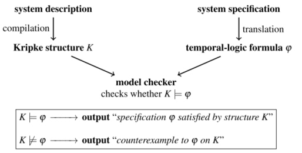
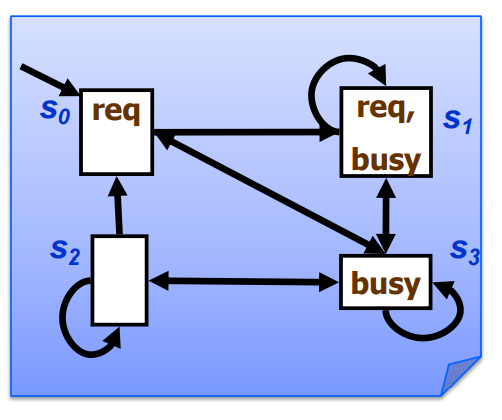
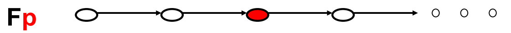
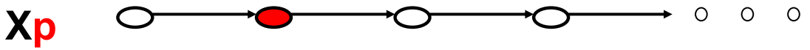
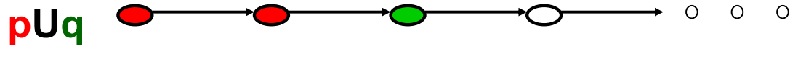
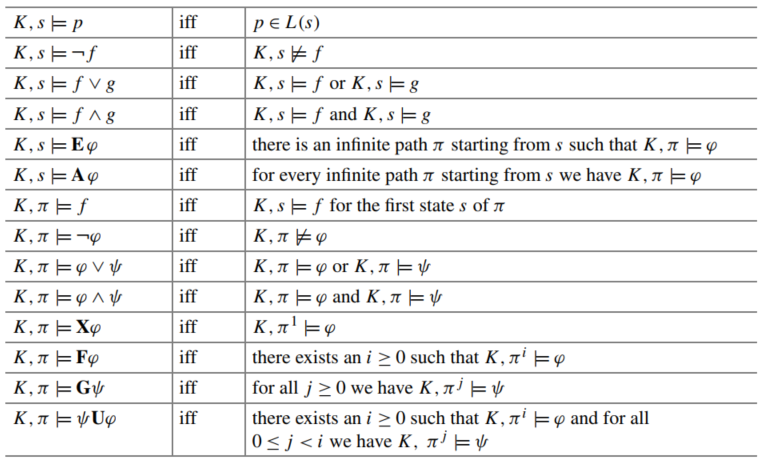
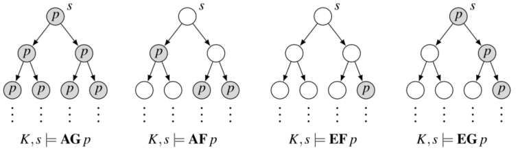

# Notes on `Handbook of Model Checking`

## Reference：

* Handbook of Model Checking
* ECE.750t29 Automated Program Verification from Waterloo

## Chapter 1 Introduction to Model Checking
### 1.1 The Case for Computer-Aided Verification  

"The only effective way to raise the confidence level of a program significantly is to give a convincing proof of its correctness."

* Modeling.

* Specification.

* Algorithms. 

* Basic model-checking methodology  

  * 

  

* The algorithmic challenge: combinatorial explosion of states in the Kripke structure—the "state-explosion problem." 

* The modeling challenge: Extend the model-checking framework beyond Kripke structures and temporal logic. 

### 1.2 Temporal-Logic Model Checking in a Nutshell

#### 1.2.1 Kripke Structures

Conventional state machines

* $K = (V,S,s_0,I,R)$
* $V$ is a (finite) set of atomic propositions
* $S$ is a (finite) set of states
* $s0\in S$ is a start state
* $I:S \rightarrow 2^V$ is a labelling function that maps each state to the set of propositional variables that hold in it
  * That is, $I(S)$ is a set of interpretations specifying which propositions are true in each state
* $R\subseteq S\times S$ is a transition relation

#### 1.2.2 The Temporal Logic $\mathrm{CTL}^{\star}$

Path quantifiers:

* $\mathbf A$ "for every infinite path from this state"
* $\mathbf E $ "there exists an infinite path from this state"

Temporal operators (for atomic propositions p and q):

* $\mathbf Xp$ "p holds at the next state"
  * 
* $\mathbf Fp$ "p holds at some state in the future"
  * 
* $\mathbf Gp$ "q holds at all states in the future"
  * 
* $q\mathbf Up$ "p holds at some state in the future, and q holds at all states until p holds"
  * 

For instance, $\mathbf{F} p$ holds on path $\pi$ iff $\pi$ contains a state with label $p$, and $\mathbf{A} \varphi$ holds at state $s$ iff $\varphi$ holds on all infinite paths that start from state $s$.

Given a set of atomic propositions $A$, the syntax of $\mathrm{CTL}^{\star}$ is defined recursively as follows:
- If $p \in A$, then $p$ is a formula of $\mathrm{CTL}^{\star}$.
$-$ If $\varphi$ and $\psi$ are formulas of $\mathrm{CTL}^{\star}$, then $\varphi \vee \psi, \varphi \wedge \psi, \neg \varphi, \mathbf{A} \varphi, \mathbf{E} \varphi, \mathbf{X} \varphi, \mathbf{F} \varphi, \mathbf{G} \psi$, and $\psi \mathbf{U} \varphi$ are formulas of $\mathrm{CTL}^{\star}$.

Given a Kripke structure $K$, state $s$, and state formula $f$ , a model-checking algorithm is a decision procedure for $K,s \models f$ .  

* Semantics of $\mathrm{CTL}^{\star}$. Here, $K$ is a Kripke structure, $\pi$ is a path, $s$ is a state, $p$ is an atomic
  proposition, $f$ and $g$ are state formulas, and $\varphi$ and $\psi$ are  $\mathrm{CTL}^{\star}$formulas  

#### 1.2.3 The Temporal Logic CTL

CTL (Computation Tree Logic) is the syntactic fragment of  $\mathrm{CTL}^{\star}$ in which every path quantifier is immediately followed by a temporal operator:  

* If $p \in A$, then $p$ is a CTL formula.

* If $\varphi$ and $\psi$ are CTL formulas, then $\varphi \vee \psi, \varphi \wedge \psi, \neg \varphi, \mathbf{A X} \varphi, \mathbf{E X} \varphi, \mathbf{A F} \varphi, \mathbf{E F} \varphi$, $\mathbf{A G} \psi, \mathbf{E G} \psi, \mathbf{A} \psi \mathbf{U} \varphi$, and $\mathbf{E} \psi \mathbf{U} \varphi$ are CTL formulas.

In other words, CTL can be viewed as a propositional modal logic based on the compound operators $\mathbf{A X}, \mathbf{E X}, \mathbf{A F}, \mathbf{E F}, \mathbf{A G}, \mathbf{E G}, \mathbf{A}$, and $\mathbf{E U}$;

* **Theorem 1**: *There is a CTL model-checking algorithm whose running time depends linearly on the size of the Kripke structure and on the length of the CTL formula (if the other parameter is fixed).*  

#### 1.2.4 The Temporal Logic LTL  

LTL (Linear-time Temporal Logic) is the syntactic fragment of CTL ${ }^{\star}$ that contains no path quantifiers except a leading $\mathbf{A}$ :
- If $p \in A$, then $p$ is an $\mathrm{LTL}^{-}$formula.
- If $\varphi$ and $\psi$ are LTL $^{-}$formulas, then $\varphi \vee \psi, \varphi \wedge \psi, \neg \varphi, \mathbf{X} \varphi, \mathbf{F} \varphi, \mathbf{G} \psi$, and $\psi \mathbf{U} \varphi$ are $\mathrm{LTL}^{-}$formulas.
- If $\psi$ is an LTL $^{-}$formula, then $\mathbf{A} \psi$ is an LTL formula.
LTL is also called the linear-time fragment of the branching-time logic $\mathrm{CTL}^{\star}$. This is because the LTL $^{-}$formulas are interpreted over paths, i.e., over linear sequences of states.
- **Theorem 2**: *There is an LTL model-checking algorithm whose running time depends linearly on the size of the Kripke structure and exponentially on the length of the LTL formula.*  

### 1.3 A Very Brief Guide Through the Chapters of the Handbook  

#### 1.3.1 The Algorithmic Challenge

主要用来解决state explosion的问题：

* Structural methods
* Symbolic methods
* Abstraction

#### 1.3.2 The Modeling Challenge  

* Security protocols
* Graph games
* Probabilistic systems
* Real-time and hybrid systems

## Chapter 2 Temporal Logic and Fair Discrete Systems  