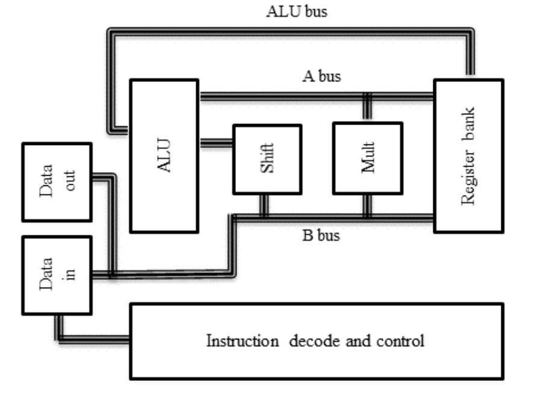

Note written by 尤存翰 2023/2/27

# Tool: ELMO

## Towards Practical Tools for Side Channel Aware Software Engineering: ‘Grey Box’ Modelling for Instruction Leakages

David McCann, Elisabeth Oswald, and Carolyn Whitnall University of Bristol

USENIX Security Symposium 2017

## 本文总结

可以学习本文对于表征现代化的微处理器的方法和建模，但本文验证的ARM 的指令太少，可能和作者选取的仿真器支持数量不够多有关，我在选取仿真器的时候可以注意一点。

## 摘要

| **Leakage Model** | **Target**    | **Function**   |
| :---------------- | :------------ | :------------- |
| gray              | ARM Cortex-M0 | Detect (power) |

本文提出了一种新的建模技术，能够产生高质量的指令级的power模型，而不需要处理器的详细的硬件描述，也不需要所使用的工艺技术信息（因为一般来说对这两者的访问通常是受限制的）

在此之后又有两个新的tool依赖于此工具：

* Rosita
* Rosita++

## 本文贡献：

* 提出了一种建立精炼的汇编代码指令级功率追踪模拟器的策略，并表明它适用于与物联网背景相关的两个处理器：ARM Cortex M0和M4。
* 为 M0 全面开发了该工具并验证了其在侧面通道早期评估中的效用。
* 实现了一个新的侧信道建模程序，它通过纳入既定的线性回归达到了彻底的模型选择技术。
  * 验证可移植性。
* 实现了一个程序，用于提取任意代码序列的数据流，随后可以通过模型将其映射到跟踪预测中。

## ARM CPU架构

本文选取一部分指令集进行实验：

* ldr, ldrb, ldrh, str, strb, strh, lsls, lsrs, rors, muls, eors, ands, adds, adds #imm, subs, subs #imm, orrs, cmp, cmp #imm, movs and movs #imm

## 实验准备

使用ST Microelectronics在STM板上实现的两个处理器，其中ARM Cortex-M0在STM32F0（30R8T6）发现板上实现，ARM Cotex-M4在STM32F4（07VGT6）上实现。这些板子都具有ST-Link，可以将程序闪存到处理器上，并提供片上调试功能以及板上RC振荡器时钟信号（STM32F0和STM32F4分别为8Mhz和16Mhz）。为了获得Cortex-M0的精确功率测量，作者修改了STM32F0板，提取了处理器的电源引脚，并将电源通过一个360Ω的电阻，上面连接了一个差分探头。这是为了最大限度地减少电路板和设置影响的可能性。此外还验证了电源的稳定性。为了测量Cortex-M4处理器上的电磁辐射，在通往处理器的一个电源引脚的一个电容器的输出上放置了一个小型电磁探针。作者使用了Lecroy Waverunner 700 Zi范围，采样率为500 MS/S，用于电源和电磁分析。这个采样率是通过观察Cortex-M0在不同采样率下的DPA结果来选择的。500 MS/S是取得最佳DPA结果的最低采样率。Cortex-M0的时钟速度被设定为8Mhz，Cortex-M4被设定为16Mhz。为了降低独立噪声，我对M0的功率测量（因为发现这是带来最大信号增益的最低数量）和M4的电磁测量（为了进一步减少与这种取样方法相关的额外噪声）的每个输入进行了平均采集。Cortex-M0的功率测量没有进行过滤或进一步的信号处理，但是在放大Cortex-M4的EM信号之前使用了一个48Mhz的低通滤波器。注意到对EM的测量只在处理器的多个电源输入中使用了一个探针（对于M0，将电源输入的数量减少到一个，以便进行测量），虽然对（噪音较大的）EM测量进行了一些预处理，但本可以尝试更彻底的技术来增强信号。因此，对不同电路板的两种测量设置代表了为获得更好的测量而投入的时间和精力的不同端点。通过这种方式，旨在了解该分析方法如何适应不同的设置方案以及不同的处理器。

## 一种新的方法来表征现代化的微处理器

### 建模

$$
\mathbf{y}=\delta+\left[\mathbf{O}_1\left|\mathbf{O}_2\right| \mathbf{T}_1 \mid \mathbf{T}_2\right] \boldsymbol{\beta}+\varepsilon
$$
其中 $\mathbf{O}_{\mathbf{i}}=\left[\mathbf{x}_{\mathbf{i}}[0]\left|\mathbf{x}_{\mathbf{i}}[1]\right| \ldots \mid \mathbf{x}_{\mathbf{i}}[31]\right]$ 是跨总线的操作数的矩阵  $i=1,2, \mathbf{T}_{\mathbf{i}}=\left[\mathbf{x}_{\mathbf{i}}[0] \oplus \mathbf{z}_{\mathbf{i}}[0]|\ldots| \mathbf{x}_{\mathbf{i}}[31] \oplus \mathbf{z}_{\mathbf{i}}[31]\right]$ 是跨总线$i=1,2$的位转换矩阵（即。$[b]$表示$b^{t h}$位，$\mathbf{x}_{\mathbf{i}}$表示给定指令的$i^{\text {th }}$操作数，$\mathbf{z}_{\mathbf{i}}$表示前一指令的$i^{\text {th }}$操作数，'l' 表示矩阵连接）。标量截距$\delta$和系数向量$\boldsymbol{\beta}$是要估计的模型参数，$\boldsymbol{\varepsilon}$是误差项（噪声）向量，为了推理，假定在所有观测中具有恒定的、不相关的方差。 如果噪声可以另外被假定为正态分布，那么假设检验的有效性就会成立，而不需要求助于检验统计量的渐进特性。

### 选择解释型变量

纳入模型的标准是基于F检验的。考虑两个模型，$A$和$B$，使$A$"嵌套 "在$B$内--即它有$p_A<p_B$的参数与$B$模型的拟合项的子集$\left(\right. $ e.g. $\mathbf{y}=\delta^{\prime}+\left[\mathbf{O}_{\mathbf{2}}\left|\mathbf{T}_{\mathbf{1}}\right| \mathbf{T}_{\mathbf{2}}\right] \boldsymbol{\beta}^{\prime}+$$\varepsilon^{\prime}$与上述（1）相比）。我们对$A$中省略的项（在我们的例子中，第一个操作数的位）的联合意义感兴趣。检验统计量是通过每个模型的残差平方和$(\mathrm{RSS})$，以及它们各自的参数数$p_A, p_B$和样本量$n$计算的，如下所示。
$$
F=\frac{\left(\frac{\mathrm{RSS}_A-\mathrm{RSS}_B}{p_B-p_A}\right)}{\left(\frac{\mathrm{RSS}_B}{n-p_B}\right)}
$$
$F$具有$\left(p_B-p_A, n-p_B\right)$自由度的F分布。如果在给定的显著性水平下（通常是$\alpha=5%$）$F$大于$F_{p_B-p_A, n-p_B}$分布的临界值。我们就拒绝无效假设，并得出结论，被测项确实有影响。如果$F$小于临界值，我们就说没有证据可以拒绝无效假设。

## ELMO的搭建

作者使用了一个名为Thumbulator的开源（用C语言）仿真器。我们选择它而不是更著名的仿真器因为它的简单性和易于适应我们的目的。这种选择的一个缺点是，它没有经过良好的测试；它还省略了少量的 在 ARMv6-M 指令集中提供的 Thumb-2 指令。

## Reference

1. Li, Xun, et al. "Caisson: a hardware description language for secure information flow." *ACM Sigplan Notices* 46.6 (2011): 109-120.
2. Zhang, Danfeng, et al. "A hardware design language for timing-sensitive information-flow security." *Acm Sigplan Notices* 50.4 (2015): 503-516.
