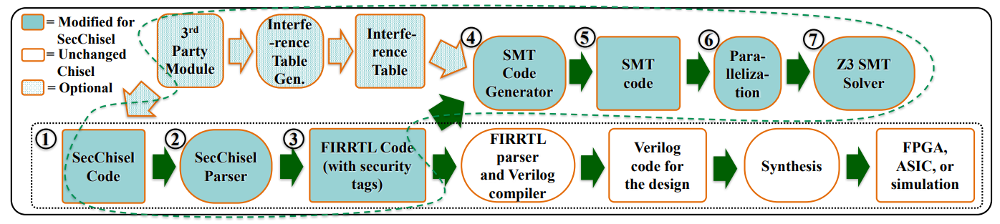

Note written by 尤存翰 2022/12/14

# SecChisel Framework for Security Verification of Secure Processor Architectures

Deng, Shuwen, Doğuhan Gümüşoğlu, Wenjie Xiong, Sercan Sari, Y. Serhan Gener, Corine Lu, Onur Demir, and Jakub Szefer. 

In *Proceedings of the 8th International Workshop on Hardware and Architectural Support for Security and Privacy*, pp. 1-8. 2019.

本文为安全的cpu架构提供了一个design-time的安全验证框架，SecChisel。该框架基于Chisel硬件构建语言和工具，并在设计时使用信息流分析来验证架构的安全属性。为了加强信息流安全性，该框架支持向电线、寄存器、模块和设计描述的其他部分添加安全标签，并允许定义自定义安全网格和自定义信息流策略。该框架在新的SecChisel解析器中执行自动安全标签传播分析，并使用Z3-SMT解算器进行信息流检查。相同的SecChisel代码库用于设计硬件模块以及验证安全属性，确保验证的设计与实际设计直接对应。该框架在扩展了AES和SHA模块的RISC-V Rocket芯片上进行了评估。该框架能够捕获硬件bug或木马中的信息泄漏，并对其进行测试。

相关工作：

* Caisson [1]
* SecVerilog [2]

本框架与现有proj Caisson和SecVerilog类似，SecChisel在修改后的硬件描述语言中嵌入了安全标签。新的安全标签在设计时用于信息流跟踪方法，不会增加实际硬件的开销。新方法支持Caisson中没有的动态值标签，这在推理不同计算周期中可能保存公共或私有数据的原语（如导线或寄存器）时非常有用。而且，与SecVerilog不同，SecChisel的用户无需学习或编写SMT代码。根据作者所说，这也是第一个支持嵌套模块的硬件安全验证框架，无需单独检查单个模块。

## 本文主要贡献

* 第一个基于Chisel的安全验证框架，它利用了information flow tracking和SMT solver。
* 第一个支持嵌套模块验证的硬件安全验证框架，无需单独检查单个模块。
* 灵活的安全验证框架，支持第三方模块的静态和动态标签、declassification mechanisms和interference tables。
* 在RISC-V Rocket Processor中使用AES和SHA安全RoCC评估框架的功能和性能，快速运行时间和检测硬件错误或木马导致的信息泄漏的能力。

## SecChisel框架

整个SecChisel的流程如上图所示，它包含以下这些元件：

* SecChisel Code (上图的1)
  * 硬件描述，包括安全网格描述、新安全标签、动态标签范围函数和解密。
  * Security lattice definition: 我们可以将变量定义为“High”或者 “Low”, 如下图的roundkey
  * 
* SecChisel Parser (2)
  * 基于Chisel的parser，增加了变量的tag信息。
* FIRRTL code (3)
  * 由SecChisel Code通过SecChisel Parser生成的中间表示形式，与传统的chisel FIRRTL相比增加了变量的tag信息。
* SMT Code Generator (4)
  * 用于将FIRRTL解析为FIRRTL expr/stat树的工具，然后将其处理为SMT solver使用的SMT语句，具体流程如下。
  * (Phase 1) Parse the FIRRTL file, 然后增加一个叫 $L_{taggedVariable}$ 的structure用来存储变量和tag信息。
  * (Phase 2) 为所有变量创建tags：除了设计者在SecChisel中明确标记的变量外，没有标记的变量用$Undefined$标记，所有数据都存储在新的$L_{default}$结构中。
  * (Phase 3) 处理$L_{default}$ 中那些undefined的tags 把他们存在 $L_{redefined}$ structure中.
  * (Phase 4) 输出SMT code, $F_{SMT}$ , 里面存有security lattice, tag-range functions和tag information在$L_{redefined}$中。
* SMT Code (5)
  * 上文generator生成的SMT代码。
* Parallelization (6)
  * Z3 SMTsolver进行验证的时候，由于框架生成的SMT代码非常结构化，因此可以并行化断言检查。对于SMT代码，每个SMT文件中有两个部分：
  * 1）security tags, tag-ranges, security lattice的预定义规则
  * 2）用于检查每个操作的信息流的实际断言。
  * 所有断言都需要写rules，但是他们可以独立于其他断言来检查。然后可以通过将源SMT文件转换为多个不同的文件来并行化SMT代码，其中每个文件都有相同的规则，但断言被均匀地分割为n个文件。然后，这n个文件可以由并行进程执行。
  * 据作者所言，这里可以提速20x，感觉有点离谱。
* Z3 SMT Solver (7)
* Interference Table (optional)
  * 第三方黑盒模块可以用作验证的一部分。

## Reference

1. Li, Xun, et al. "Caisson: a hardware description language for secure information flow." *ACM Sigplan Notices* 46.6 (2011): 109-120.
2. Zhang, Danfeng, et al. "A hardware design language for timing-sensitive information-flow security." *Acm Sigplan Notices* 50.4 (2015): 503-516.
