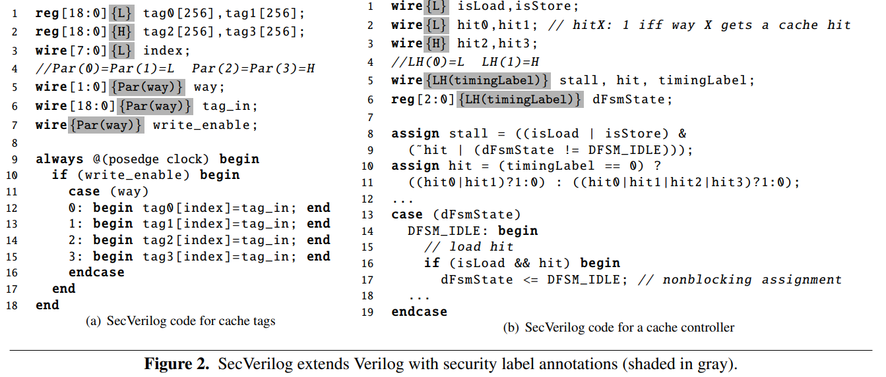
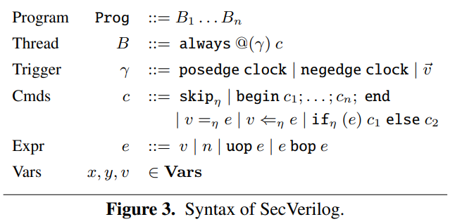
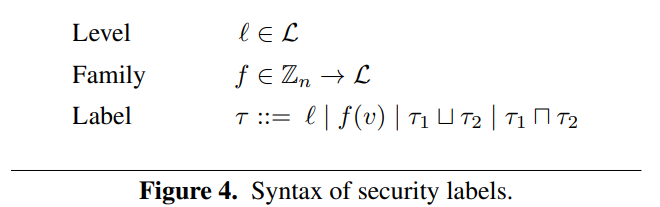
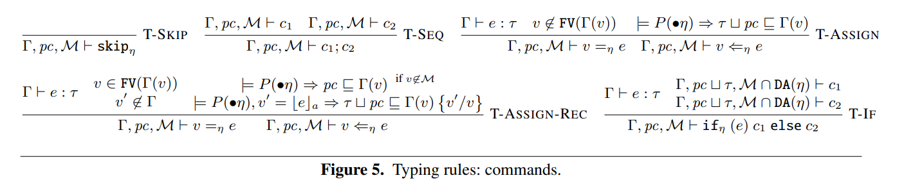
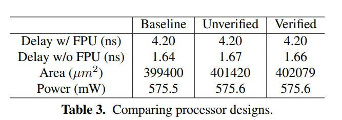
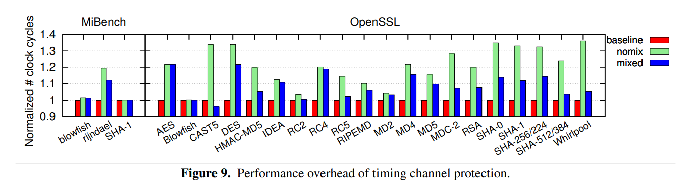
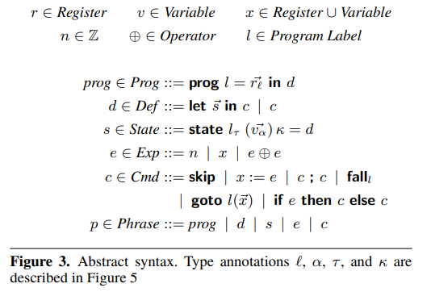
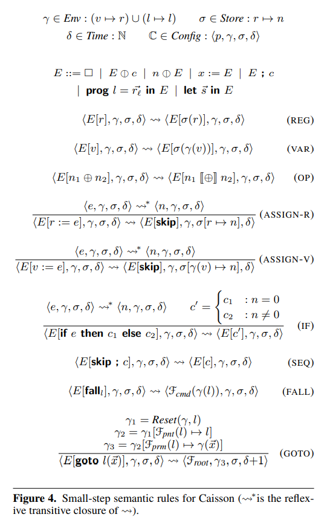

Note written by 尤存翰 2022/12/15

# A Hardware Design Language for Timing-Sensitive Information-Flow Security

Danfeng Zhang Yao Wang G. Edward Suh Andrew C. Myers Cornell University

[ACM SIGPLAN Notices](https://dl.acm.org/toc/sigplan/2015/50/4)[Volume 50](https://dl.acm.org/toc/sigplan/2015/50/4)[Issue 4](https://dl.acm.org/toc/sigplan/2015/50/4) April 2015 pp 503–516 https://doi.org/10.1145/2775054.2694372

信息安全可能会因底层硬件实现的泄漏而受到损害。最近一个突出的例子是 cache probing attacks，它依赖于缓存创建的timing通道。本文介绍了一种硬件设计语言SecVerilog，它可以在硬件级别静态分析信息流。有了SecVerilog，可以通过对定时信道和其他信息信道的可验证控制来构建系统。SecVerilog是基于Verilog，扩展了表达型注释，可以对信息流进行精确推理的语言。

它还提供了严格的形式保证（证明SecVerilog强制执行对时间的不敏感，从而确保了信息流的安全。）

本文通过构建一个安全的MIPS处理器及其缓存，证明SecVerilog使构建复杂的硬件设计成为可能。

## 本文主要贡献

* 设计了SecVerilog，一种新的硬件描述语言，它通过对硬件内信息流的跟踪来扩展Verilog。
* 包含相关安全类型的表达式静态注释，实现flexible, fine-grained的重用和跨安全级别的硬件共享，
* HDL型系统能soundly控制信息流的正式证明（？文章里的证明很片面，看不明白，打算等学完了Program Verification再来看看）
* 使用SecVerilog设计了一个安全的微处理器，证明了该方法的power。delay, area, power, performance and designer effort都很低。

## SecChisel框架

### The SecVerilog approach

参考下图的cache实现，灰字部分是从Verilog到SecVerilog的label扩展，这点和SecChisel很像，在设计硬件安全框架时也许是个公认的好方法（？）

这样设计有什么好处？

首先，验证是在编译时完成的，避免了运行时的开销，并在早期设计阶段检测到错误。这在GLIFT[1]和Sapper[2]中是不可能的。其次，变量和逻辑可以在多个安全级别中共享（例如，方式和命中与各种时序标签共享），这在Caisson [3]中是不可能的。此外，SecVerilog增加的编程工作量很小。Verilog代码几乎可以按原样进行验证，仅在变量声明中需要注释（安全标签）。

### 语法和语义

除了添加的注释外，SecVerilog基本上具有与Verilog相同的语法和语义。

### SecVerilog的类型系统

SecVerilog中的类型只是用安全标签表达式扩展的Verilog类型，见下图。

（原文摘抄）SecVerilog类型系统以严格和可验证的方式静态控制信息流。该类型系统最新颖的特点包括：

* 可变的、依赖的安全标签（类似于SecChisel）
* 控制标签通道的permissive但是sound的方式
* 模块化设计，将精度所需的程序分析与类型系统分开控制

与以前大多数基于语言的安全性工作不同，SecVerilog支持动态标签，也也就是可以在运行时更改的标签。使用应用于变量$v$的类型值函数$f$来构造动态标签$f(v)$。

### Soundness证明

（待填写）

### 实验结果

下图是对验证过的，没验证过的做区分的evaluation，包含Delay, area and power.

下图是OpenSSL的例子，其中评估了两种安全策略：“nomix”，整个程序标记为H，对应于以前安全硬件设计方法所针对的安全策略；“mixed”，允许混合H和L指令，是SecVerilog的新特性。

## Ref

[1] M. Tiwari, H. M. Wassel, B. Mazloom, S. Mysore, F. T. Chong, and T. Sherwood. Complete information flow tracking from the gates up. In ASPLOS XIV, pages 109–120, 2009.

[2] X. Li, V. Kashyap, J. K. Oberg, M. Tiwari, V. R. Rajarathinam, R. Kastner, T. Sherwood, B. Hardekopf, and F. T. Chong. Sapper: A language for hardware-level security policy enforcement. In Proc. 19th Int’l Conference on Architectural Support for Programming Languages and Operating Systems (ASPLOS), pages 97–112, 2014.

[3] X. Li, M. Tiwari, J. Oberg, V. Kashyap, F. Chong, T. Sherwood, and B. Hardekopf. Caisson: a hardware description language for secure information flow. In ACM SIGPLAN Conf. on Programming Language Design and Implementation (PLDI), pages 109–120, 2011.

# Caisson: a hardware description language for secure information flow.（目前正在看，预计12.21左右完成）

[ACM SIGPLAN Notices](https://dl.acm.org/toc/sigplan/2011/46/6)[Volume 46](https://dl.acm.org/toc/sigplan/2011/46/6)[Issue 6](https://dl.acm.org/toc/sigplan/2011/46/6) June 2011 pp 109–120 https://doi.org/10.1145/1993316.1993512

Xun Li, Mohit Tiwari, Jason K. Oberg, Vineeth Kashyap, Frederic T. Chong, Timothy Sherwood, Ben Hardekopf

Department of Computer Science University of California, Santa Barbara, CA

信息流是一个重要的安全属性，必须从头开始纳入，包括在硬件设计时，为系统的信任根基提供一个正式的基础。本文结合了设计信息流安全编程语言的见解和技术，为设计安全硬件提供了一个新的视角。作者描述了一种新的硬件描述语言Caisson，它将硬件设计中常见的特定领域的抽象与安全编程语言中使用的基于类型的技术的见解相结合。这些元素的适当组合允许一个有表达力的、可证明是安全的HDL，在该语言的目标受众--硬件设计师--熟悉的抽象水平上运行。

作者为Caisson实现了一个编译器，将设计翻译成Verilog，然后使用现有的工具对设计进行综合。作为Caisson有用性的一个例子，作者已经解决了安全硬件中的一个开放性问题，创建了有史以来第一个具有微架构特征（包括流水线和高速缓存）的可证明的信息流安全处理器。本文合成了安全处理器，并在芯片面积、功耗和时钟频率方面与标准（不安全）的商业处理器和在门级增强的处理器进行了经验比较，以动态跟踪信息流。本文合成的处理器与不安全的处理器相比是有竞争力的，而且明显优于动态跟踪。

## 本文主要贡献

* 设计了Caisson，一种针对可静态验证的信息流安全硬件设计的硬件描述语言。
* 正式证明了Caisson可以执行对时间敏感的非干涉。
* 设计并实现了一个可验证的信息流安全处理器，它具有复杂的微结构特征，包括流水线和缓存。
* 将Caisson与不安全的商业CPU设计以及动态跟踪信息流的GLIFT CPU设计进行了经验性比较。在芯片面积（1.35倍对3.34倍）、时钟频率（1.46倍对2.63倍）和功率（1.09倍对2.82倍）方面，Caisson比GLIFT的基线处理器引入的开销少得多。

## 语法和语义

# Challenges and Opportunities of Security-Aware EDA （计划中，待填写）

JAKOB FELDTKELLER, Ruhr University Bochum, Germany

PASCAL SASDRICH, Ruhr University Bochum, Germany

TIM GÜNEYSU, Ruhr University Bochum, Germany

DFKI, Cyber-Physical Systems, Germany

# TODO: 把各种HDL安全框架放一起做个比对，然后看一下有没有什么可以提升的空间
