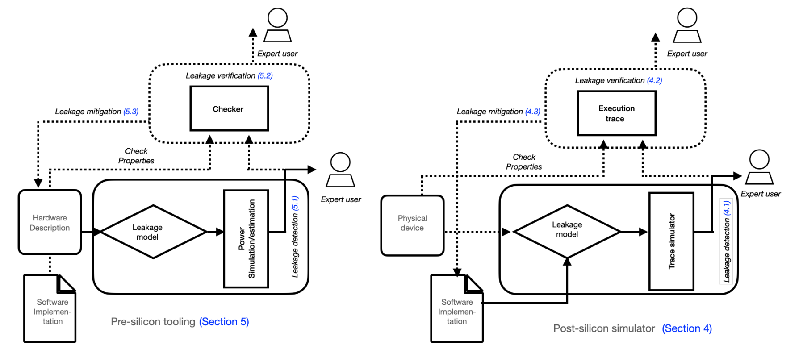

# SoK: Design Tools for Side-Channel-Aware Implementations

### Updated by youch 2023/2/13

(ASIA CCS ’22), May 30-June 3, 2022, Nagasaki, Japan. ACM, New York, NY, USA, 15 pages. https://doi.org/10.1145/3488932.3517415

本文根据这篇SoK对自动泄漏检测的方法进行分类，持续更新，*为文章内未提到的新工具，后续会对各工具做review。

Pre-silicon和Post-silicon仿真器的高层次结构。用连续的线条表示泄漏检测所需的基本组件，用虚线表示verification和mitigation的可选但有用的功能。两者之间明显的区别之一是仿真的对象。Post-silicon仿真器用于保证软件实现的安全性。Pre-silicon仿真器用于确保硬件目标的安全，它与软件实现相结合进行测试。

## **Post-silicon side-channel leakage emulators (power)**

排列顺序是从新到旧的

| **Name**                                                     | **Year** | **Leakage Model** | **Target**            | **Function**          |
| :----------------------------------------------------------- | :------- | :---------------- | :-------------------- | :-------------------- |
| * [ARMISTICE](https://eprint.iacr.org/2022/467.pdf)          | 2022     | tba               | ARM Cortex-M3         | tba                   |
| * [ABBY](https://eprint.iacr.org/2021/1569)                  | 2022     | gray              | ARM Cortex-M0         | Detect                |
| [ROSITA++](https://eprint.iacr.org/2021/1181), [**repo**](https://github.com/0xADE1A1DE/Rositaplusplus) | 2021     | gray              | ARM Cortex-M0         | Mitigate (high order) |
| [ROSITA](https://eprint.iacr.org/2019/1445), [**repo**](https://github.com/0xADE1A1DE/Rosita) | 2021     | gray              | ARM Cortex-M0         | Mitigate (1-order)    |
| [ELMO](https://eprint.iacr.org/2016/517), [**repo**](https://github.com/sca-research/ELMO) | 2017     | gray              | ARM Cortex-M0         | Detect                |
| [ASCOLD](https://eprint.iacr.org/2017/345), [**repo**](https://github.com/nikita-veshchikov/ascold) | 2017     | gray              | ATMega163             | Detect                |
| [SAVRASCA](https://ieeexplore.ieee.org/document/7961951), [**repo**](https://github.com/nikita-veshchikov/savrasca) | 2017     | gray              | ATMega163             | Verify                |
| [Reparaz](https://www.iacr.org/archive/fse2016/97830195/97830195.pdf) | 2016     | black             | software              | Detect                |
| [SLEAK](https://www.mitre.org/publications/technical-papers/sleak-a-side-channel-leakage-evaluator-and-analysis-kit) | 2014     | black             | ARM Cortex-A8         | Verify                |
| [SILK](https://dl.acm.org/doi/10.1145/2689702.2689706), [**repo**](https://github.com/nikita-veshchikov/silk) | 2014     | black             | ATMega328P            | Detect                |
| [Gagnerot](http://aurore.unilim.fr/ori-oai-search/notice/view/unilim-ori-59315) | 2013     | black             | RISC-V(not specified) | Verify                |
| [Debande](https://eprint.iacr.org/2012/703.pdf)              | 2012     | gray              | not specified         | Verify                |
| [Oscar](https://dl.acm.org/doi/10.1109/CSE.2009.119)         | 2009     | black             | AT90XX,ATMegaXX       | Verify                |
| [InspectorSCA](https://www.riscure.com/security-tools/inspector-sca) | 2007     | black             | software              | Verify                |
| [PINPAS](https://research.utwente.nl/en/publications/pinpas-a-tool-for-power-analysis-of-smartcards) | 2003     | black             | smartcards            | Verify                |

**EM side-channel leakage emulation**

| **Name**                                              | **Year** | **Leakage Model** | **Target**     | **Function** |
| :---------------------------------------------------- | :------- | :---------------- | :------------- | :----------- |
| [EMSIM](https://ieeexplore.ieee.org/document/9065440) | 2020     | white             | Risc-V(custom) | Detect       |

## **Pre-silicon side-channel leakage emulators (power)** 

排列顺序是抽象程度

| **Name**                                                     | **Year** | **Abstraction** | **Target**                                                   | **Function** |
| :----------------------------------------------------------- | :------- | :-------------- | :----------------------------------------------------------- | :----------- |
| [MAPS](https://link.springer.com/chapter/10.1007/978-3-319-89641-0_5), [**repo**](https://github.com/cryptolu/maps) | 2018     | ISA             | ARM Cortex M3                                                | Detect       |
| [AMASIVE](https://link.springer.com/chapter/10.1007/978-3-642-42001-6_12) | 2013     | RTL             | -                                                            | Detect       |
| [RT-PSC](https://jin.ece.ufl.edu/papers/VTS19.pdf)           | 2019     | RTL             | [AES-GF](http://www.aoki.ecei.tohoku.ac.jp/crypto/web/cores.html), [AES_LUT](http://satoh.cs.uec.ac.jp/SAKURA/hardware/SAKURA-G.html) | Detect       |
| [NCSIM](https://citeseerx.ist.psu.edu/viewdoc/download?doi=10.1.1.113.638&rep=rep1&type=pdf) | 2007     | gate            | [SCARD](https://cordis.europa.eu/project/id/507270)          | Detect       |
| [CASCADE](https://www.esat.kuleuven.be/cosic/publications/article-3204.pdf), [**repo**](https://github.com/dsijacic/CASCADE) | 2020     | gate            | ASIC(custom)                                                 | Detect       |
| [Patch](https://link.springer.com/article/10.1007/s11227-021-03927-w) | 2021     | gate            | AES                                                          | Mitigate     |
| [PARAM](https://arxiv.org/abs/1911.08813)                    | 2020     | gate            | RISC-V(ShaktiC)                                              | Verify       |
| [ACA](https://eprint.iacr.org/2020/1192)                     | 2020     | gate            | RISC-V(LEON3)                                                | Detect       |
| * [ACA++](https://arxiv.org/pdf/2204.11972.pdf)              | 2022     | gate            | tba                                                          | tba          |
| [SCRIPT](https://dl.acm.org/doi/10.1145/3383445)             | 2020     | gate            | [AES-GF](http://www.aoki.ecei.tohoku.ac.jp/crypto/web/cores.html), [AES_LUT](http://satoh.cs.uec.ac.jp/SAKURA/hardware/SAKURA-G.html) | Verify       |
| [COCO](https://pure.tugraz.at/ws/portalfiles/portal/30823144/main.pdf) | 2021     | gate            | RISC-V ([IBEX](https://github.com/lowRISC/ibex))             | Verify       |
| [COCOALMA](https://graz.pure.elsevier.com/en/publications/cocoalma-a-versatile-masking-verifier), [**repo**](https://github.com/IAIK/coco-alma) | 2021     | Tab             | Tab                                                          | Tab          |
| [KARNA](https://ieeexplore.ieee.org/document/8942173)        | 2019     | layout          | AES , SIMON                                                  | Mitigate     |

## OPEN PROBLEMS

* Post-silicon: 我们如何才能有效地创建fine-grained的泄漏模型?
  * 我们现在知道，仅根据架构级别的信息来对一个实现进行安全声明是不够的。我们还知道，现有的仿真器针对的是相对简单的架构。从表1可以看出，最常见的目标终端设备是ATMegaXX或ARM-Cortex M0，它们是简单的、无序的、单核CPU。在无法获得设计信息的情况下，设计者的任务是对微架构的细节进行反向工程。现在的工具可以对简单的微架构特征进行建模，如不同流水线阶段的指令依赖性活动，增加对序列依赖性的支持（一条指令所消耗的功率取决于流水线上的其他指令），或找到隐藏的存储元素。但是，创建 ELMO 等模型或逆向设计 ARM-Cortex M3 仍然是基于手工作业，而且工作量很大。捕获复杂处理器特有的微架构事件，如管道停滞或错误预测，是一个开放的问题。

* Post-silicon: 超越泄漏检测的范围是具有挑战性的。
  * 为了验证泄漏的来源，我们必须有能力知道在电力跟踪中那个特定的时间样本上执行的指令。能够将测量轨迹中的时间样本映射到所执行代码的相应指令的工具是有限的，通常分为两类：一类是机器仿真器，如Qemu、Gem5或SimulAVR；另一类是专门的硬件，如JTrace Pro2，用于具有高级调试支持的电路板，如ARM Cortex内核的追踪功能。因此，验证取决于机器仿真器是否支持该板子或是否有跟踪针。

* Post-silicon: Procedure for comparing **simulated** vs **reference** traces.
  * 一个开放的问题是我们是否应该在评估中包括泄漏模型。虽然提到的大多数措施确实包括泄漏模型，但EMSIM的作者使用归一化交叉相关来显示模拟轨迹与参考轨迹的匹配程度，而不依赖于特定的泄漏模型。这个指标的输出是一个可量化的措施，因为它计算了单个时钟周期之间的平均交叉相关。EMSIM报告说，在所有可能的指令组合中，模拟侧信道信号的准确率达到了惊人的94.1%。使用这一措施的要求是精确识别正确的时钟周期，这需要对设计细节的了解。虽然最初是对单个指令产生的侧信道的测量，但在EMSIM中使用了SAVAT（Signal Available Attacker）来测量模拟和参考轨迹之间的相似性。SCRIPT使用侧信道漏洞（side-channel vulnerability），它相当于Pre-silicon的SNR，因为它需要少量的轨迹来计算，而且根据其作者的说法，它与SNR的区别在于一个缩放系数。RTL-PSC将KL-分歧与SNR结合起来，以识别脆弱的设计块。同时，SLEAK使用算法处理的敏感值与执行二进制期间系统组件的值或状态之间的相互信息。

* Pre& Post-silicon: 对SCA(side-channel vulnerability) resilience的量化衡量。
  * 大多数侧信道对策是以较慢的性能或更多的面积为代价的。在Post-silicon方面，我们知道在评估屏蔽实现的安全性时，包括微架构特征的重要性。然而，大多数研究集中在一个平台上，并放大在所研究的平台上泄露侧信道信息的特征。即使我们知道如何对每一个微架构事件进行建模，在侧信道社区也没有广泛接受的措施来量化泄漏。我们不知道如何衡量应用SCA对抗措施时的安全 "收益"。

* Pre-silicon: 工具的共同评价标准。
  * 区分不同工具所使用的指标的客观标准将是用物理设备上存在的泄漏的结果来确认预测。实际的挑战是，没有开源的ASIC设备（即我们可以获得设计细节）进行测试。目前的最佳实践方法是使用FPGA来确认工具产生的结果是准确的。然而，ASIC门和FPGA可配置块的结构根本不同，这就为最终产品的意外泄漏留下了空间。

* Pre-silicon: Pre-silicon emulators的可组合性。
  * 虽然功率模拟技术是已知的和使用的，但主要应用是散热和电池寿命。应用于侧信道评估的功率估计的目标是捕捉瞬时功率消耗。其中一个基本要求是处理大量的依赖数据的模拟。这一类的主要挑战是找到并删除无助于泄漏的设计规范，如获得速度。每个设计阶段都有SCA感知的设计工具。我们最好在设计阶段尽可能早地消除漏洞。尽管创建一个Pre-silicon跟踪仿真器需要很大的努力，但现有的工具是零散的，不能重复使用。

* Pre& Post-silicon: EM simulation. 
  * 唯一的电磁仿真器，EMSIM，是为一个相对简单的、定制的RISC-V处理器构建的。为了构建EMSIM，需要对物理设备进行电磁测量。实验结果旨在评估当关键的微结构特征被移除时，模拟信号是如何退化的，这表明如果不能获得微结构信息，建立一个精确的电磁仿真器是不可能的。因此，我们可能只能为开源硬件建立EM仿真器。如果物理目标的存在是构建EM仿真器的必要条件，它可以解释在Pre-silicon阶段没有EM仿真器的事实。为了建立一个功率估算器，我们必须 "只 "估算有多少电荷在移动（欧姆定律）。要建立一个电磁仿真器，我们不仅要估计电荷的数量，而且还要估计它在三维空间的精确方向（麦克斯韦四定律）。目前还不清楚如何将EMSIM中使用的方法移植到更主流的处理器上。没有用于Pre-silicon的CAD工具来计算集成电路辐射的磁场，因此也没有在设计阶段检测热点的方法。为Pre-silicon阶段创建仿真器的一些希望来自于，他介绍了一个预测集成电路电磁辐射的工作流程。

* Pre& Post-silicon: Benchmark existing emulators. 
  * 虽然有些仿真器是可用的，而且是开源的，但这些工具的具体使用情况使其难以比较。另一种方法是商定一个有代表性的、涵盖不同使用情况的公共数据集，以评估一个工具的潜力。区分工具的优劣是一个挑战。如果我们比较这些工具的架构，见开头的图片，我们注意到SCRIPT和COCO使用用户输入来定义底层架构的安全条件。为了确定是否存在泄漏，MAPS和PLAN/PARAM采用了经验性的泄漏检测策略，分别是𝑡-test和SVF。另外，让我们来比较一下仿真器的输入。我们观察到，MAPS和COCO针对的是被屏蔽的软件实现，SCRIPT旨在验证加密内核，而PLAN/PARAM旨在保障终端设备或非加密实现。如果我们探讨安全保证的维度，SCRIPT和COCO的目标是正式证明，而MAPS和PLAN/PARAM则采取经验测试的方法。虽然近年来的标准做法是开源工具（因为作者主要来自学术界），但对于许多早期的工具，我们只有关于工具的能力和创新的描述，在许多情况下提供有限的信息。

* Pre& Post-silicon: 缺少非对称加密实现的案例研究。
  * 在现有文献中遇到的所有案例研究都集中在对称算法的实现上。