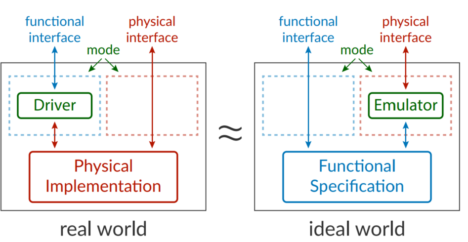
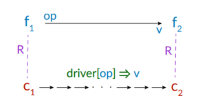
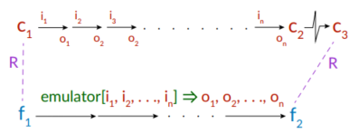
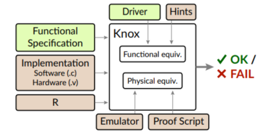
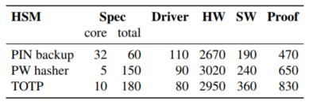

Note written by 尤存翰 2022/11/14

# Verifying Hardware Security Modules with Information-Preserving Refinement

X. Li, X. Li, C. Dall, R. Gu, J. Nieh, Y. Sait, et al.

16th USENIX Symposium on Operating Systems Design and Implementation (OSDI 22) 2022

本篇文章提出了一种安全性的定义information-preserving refinement(IPR)用来证明一个Hardware securite modules(HSMs)的安全性，安全性包括实现的功能正确性（包含硬件（本文中使用verilog文件）与软件（c语言文件）的实现），并用racket语言实现了一个名为Knox的框架，在这个框架中可以了使用刚刚定义的IPR性质去验证上述提到的实现的安全性。最后作者使用这个Knox框架对已有的三个简易的HSM进行了验证。

那么首先，本文的验证对象是Hardware securite modules(HSMs)，他的思想是，您可以将主机的核心安全操作分解到单独的设备上，即HSM上，并且这种设置在主机受损的情况下提供安全性。考虑这样一个场景，我的一些密钥可能会存储在一些单独的设备中，比如某些电子银行的密钥。我的主机，浏览器需要验证我的密钥去验证我的身份。那么主机就会与设备进行安全操作的交互，这个时候就可能会有安全问题，密钥可能会泄露。HSM模型保证了就算浏览器或主机受到威胁，私钥在此外部设备上也是安全的。

可惜的是目前的HSM都很容易出现bug，不管是硬件层面还是软件层面。所以排除掉这些bug，验证HSM的安全性是非常重要的。

本文可以做到在一个非常强力的threat model下排除掉HSM的硬件、软件和时序侧通道的漏洞。这里的threat model敌人控制住了主机因而可以随意的访问HSM的输入输出。而在此之前的工作都没有这个效果，同时验证硬件和软件的只关注正确性而忽略了安全性，比如Bedrock2[PLDI'21]和CakeML [PLDI'19] 。而对于应用安全性验证的，他们不关注硬件层面和测通道，比如lronclad Apps[OSDI'14] 。

那么本文最重要的便是定义了information-preserving refinement(IPR)这个安全性质（根据作者所说，这个思想的灵感来自于零知识证明，但我看不太出来），他主要思想就是让旁人无法区分我的具体实现（本文称为real world）与我的specification（本文称为ideal world）有什么区别。

但是验证这个性质最大的挑战便是，我的spec与我的impl相差非常大，基本无法进行比较。本文提出了一系列的方法。首先用一个relation去把我的spec与impl中的变量给关联起来去验证正确性，这个relation是developer给的。同时作者引入了两个新的元件，分别是driver和emulator。

driver的作用和驱动程序有点像，他是spec的一部分，也需要开发者给出，他把我每个spec里的操作都转化为wire-level的输入与输出，用来检查功能正确性。参考下图，对于我的spec里的每个状态$f_1$对应的实现状态$c_1$（这个对应关系由上文的relation给出）经过op操作和对应的实现里的drive[op]操作得到的状态$f_2$与$c_2$也是相关联的，那么他实现的正确性就得到了证明，如下图。

而emulator是对spec的一个wire-level behavior的仿真，需要开发者给出。他的存在主要是用来验证non-leakage和Physical equivalence。其中non-leakage只需emulator能够写得出来就可以了，因为它能保证我wire-level泄露的信息不会比我本身的实现更多。就可以保证我的spec不会泄露安全性息。而Physical equivalence需要运行一下这个emulator来检查对应的状态变化是否符合预取，和上述的功能正确性类似，如下图。

最后本文使用racket语言实现了Knox框架用于”自动化“验证给定HSM的上述IPR性质（但这么多内容，包括driver/emulator/relation/后文的hints都要开发者给出，好像也不太自动化的样子），实现结构如下。其中的Hints与proof script均需人工添加。Hints是对程序的一些性质的限定以减少状态数加快SMT-solver的执行时间。（根据作者所说，如果不加hint，时间非常慢）

最后作者用这个框架去验证了三个HSM，下图为数据。第一张图为实现行数，第二张图为验证时间（单位为分钟）FE表示功能正确性，-N表示取消了solver的不确定性预测，+C表示增加了Crash safety的检测。

